# Slack Overflow 2.0
> The Slack Overflow app is a center for resources shared for students by students via slack app or created right in the app. 

## Developers

> Thomas Seaman - Front End Developer
[https://github.com/ThomasSeaman](https://github.com/ThomasSeaman)
> Christain Lopes - Front End Developer
[https://github.com/CLopes1](https://github.com/CLopes1)
> Vicente Gonzalez - Version Control, API Intergration, Front/Back End Developer
[https://github.com/vfgonzalez](https://github.com/vfgonzalez)
> Gavin Quirk - Front/Back End Developer
[https://github.com/gavinquirk](https://github.com/gavinquirk)
> Jeremy Knappe - Front End Developer
[https://github.com/jdknappe](https://github.com/jdknappe)

[![NPM Version][npm-image]][npm-url]

> Check out the functionality live Heroku: http://slackoverflow2.herokuapp.com/main

## Dependencies

> @material-ui/core 1.2.1

> @material-ui/icons 1.1.0

> axios 0.18.0

> body-parser 1.18.3

> mongoose 5.1.6

> react 16.0.0

> react-dom 16.0.0

> react-materialize 2.3.1

> react-router 4.3.1

> react-router-dom 4.3.1

> react-scripts 1.0.14

> ssuggestor 1.0.0

> @aoberoi/passport-slack 1.0.5

> @slack/client 4.3.1

> @slack/events-api 1.0.1

> @slack/interactive-messages 0.4.0

> axios 0.18.0

> body-parser 1.18.2

> dotenv 6.0.0

> express 4.15.4

> get-urls 7.2.0

> if-env 1.0.4

> jquery 3.3.1

> material-ui-password-field 2.0.1

> moment 2.22.2

> mongoose 5.1.6

> passport 0.4.0

> passport-slack 0.0.7

> rc-tooltip 3.7.2

> react-materialize 2.3.0

> react-router 4.3.1

> react-scroll-up 1.3.3

> react-toastify 4.1.0

> react-tooltip 3.6.1

> safe-browse 1.0.1

<!-- Markdown link & img dfn's -->
[npm-image]: https://img.shields.io/npm/v/datadog-metrics.svg?style=flat-square
[npm-url]: https://npmjs.org/package/datadog-metrics
[npm-downloads]: https://img.shields.io/npm/dm/datadog-metrics.svg?style=flat-square

## App Demo

> Landing Page
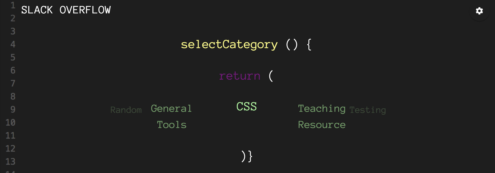

> Category Selected
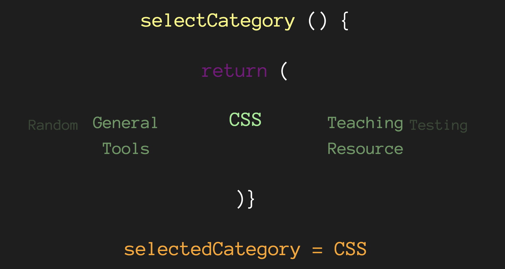

> Resources
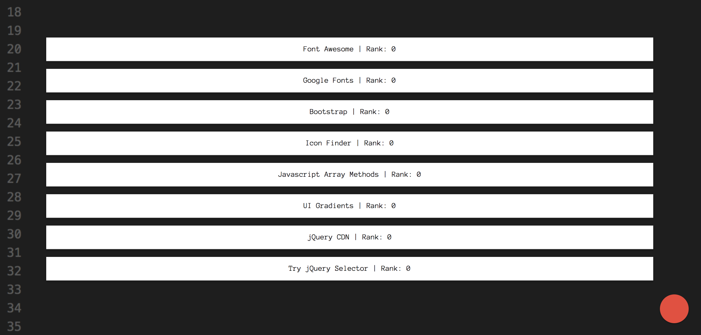

> Return to Top + New Post Button
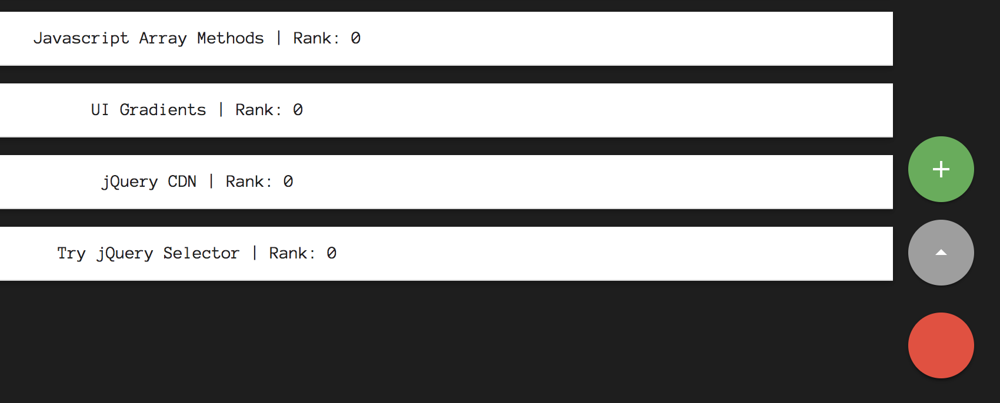

> New Post
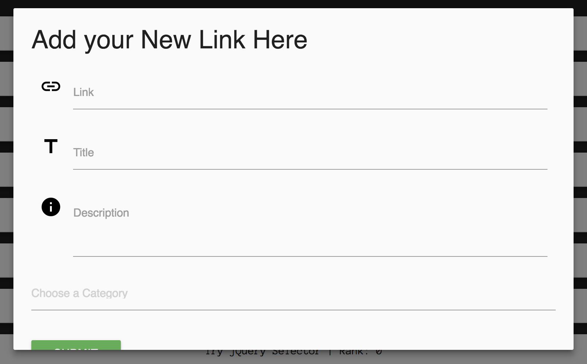

> Side Nav
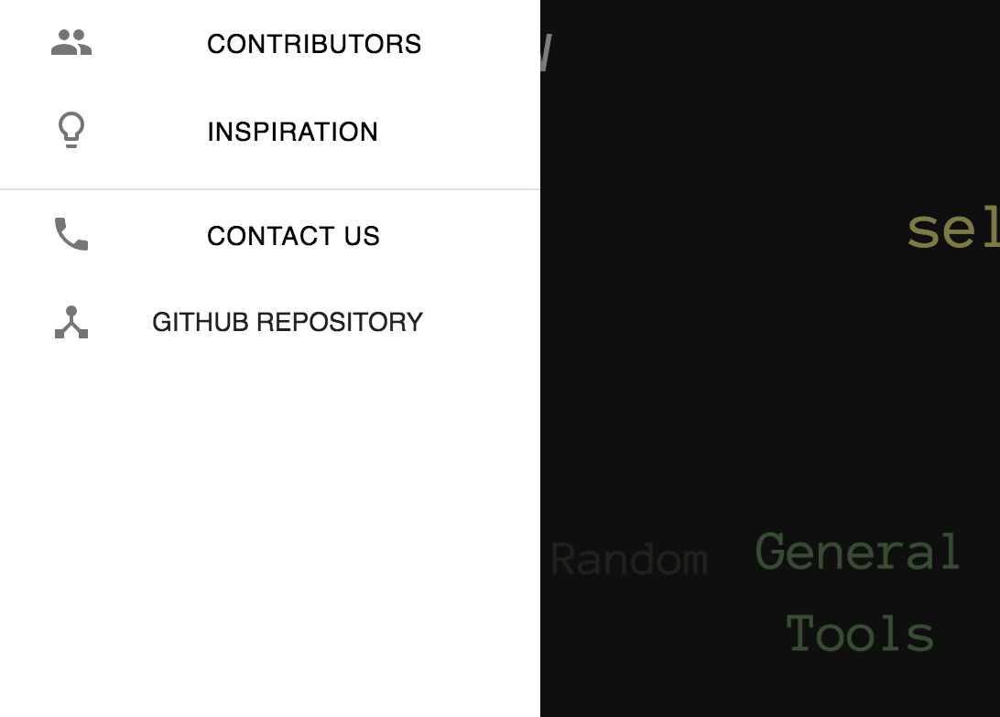

> Admin Login
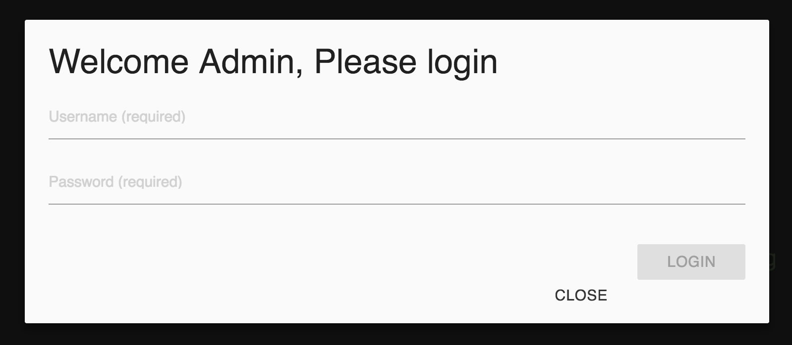

> Admin Help
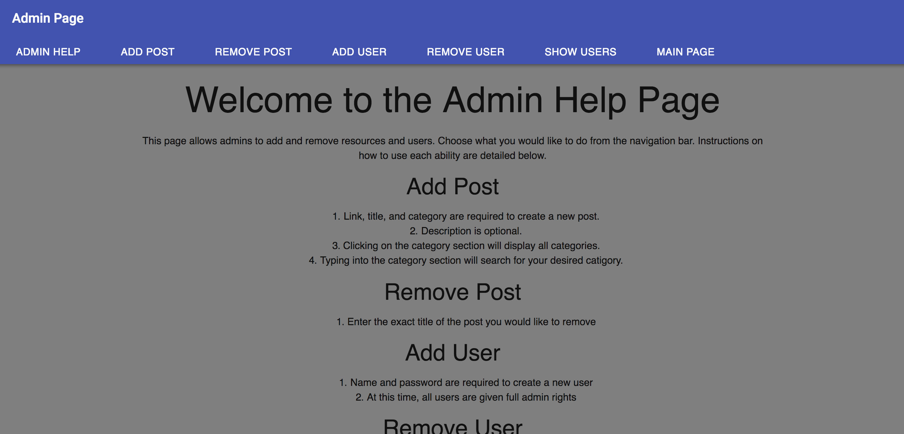

> Admin New Post
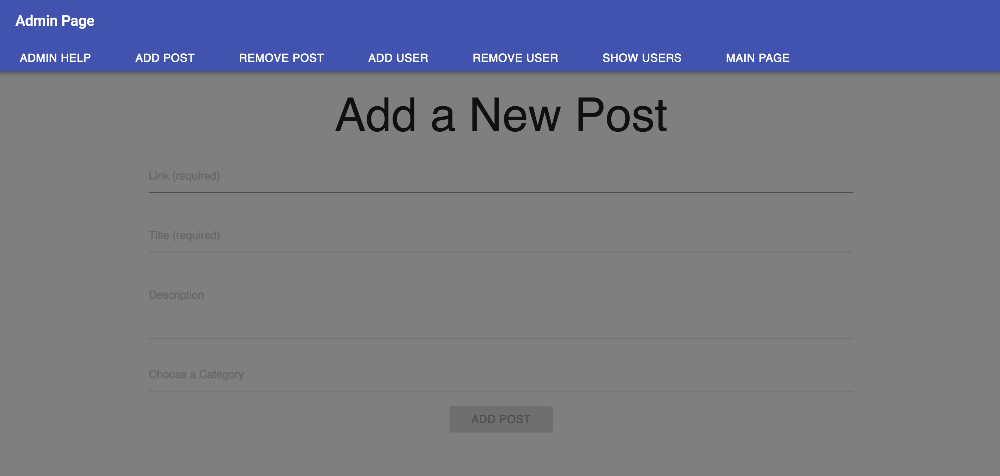

> Admin New User
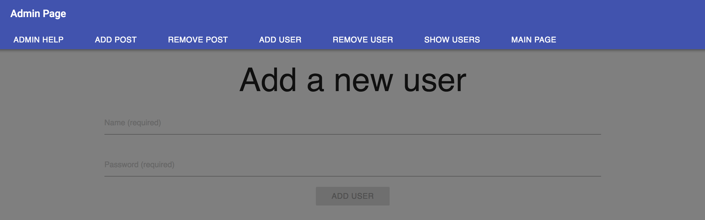

> Admin Remove Post
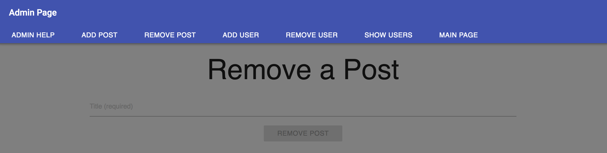

> Admin Remove User
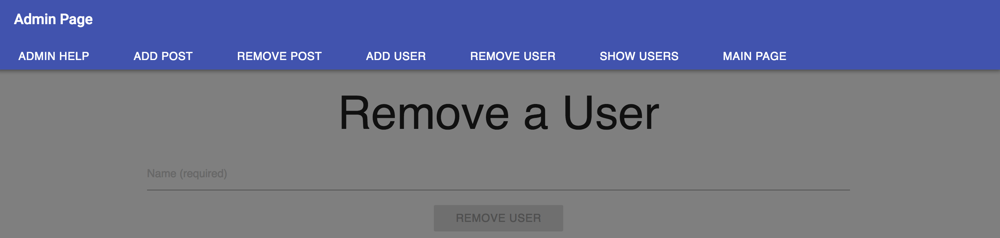

> Admin Show All Users
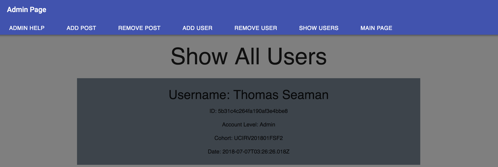
